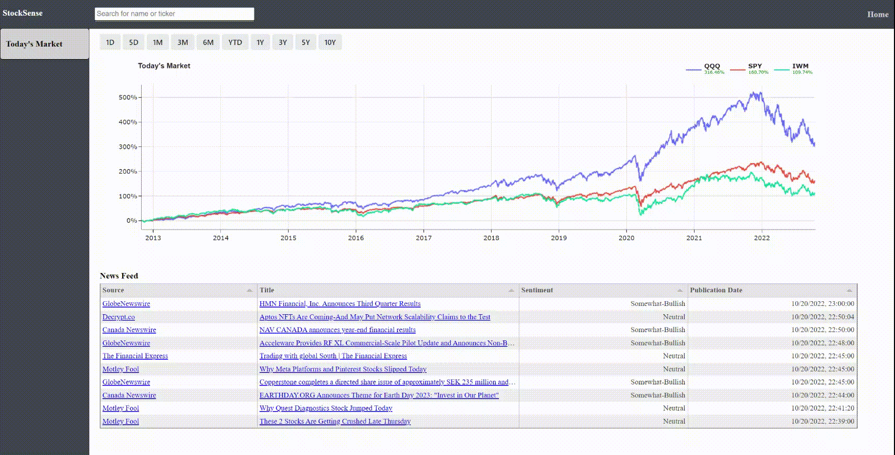
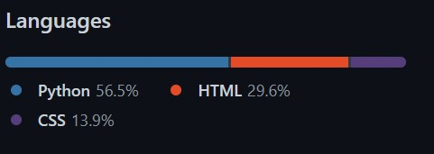

# Hands Off JS with HTMX

### Intro and Inspiration

There is an amazing amount of interactivity that can be achieved on a website without
using `JavaScript`. To demonstrate this idea, this repository runs the
following [site](http://dashboard.zmaytechstack.com/) with almost no `js`.
There were a few goals in mind when trying to build the site without `js`:

1. Implement a few of the features that are a part of [koyfin's](https://app.koyfin.com/) website
   and in doing so show that you can get a lot of the same feel and functionality as a site using a
   front-end framework (e.g., `REACT`).
2. Show a decently robust example, but that is also very simple
   and easy to follow.
3. Minimal `JavaScript` dependencies. Only three were used:
    1. [HTMX](https://htmx.org/)
    2. [Plotly](https://plotly.com/python/)
    3. [Tabulator](http://tabulator.info/)

We will walk through a couple of the features, but I'd encourage exploring
the code to get a better sense of what is going on.
Setup instructions are provided in the appendix.

**Full Disclosure:** *I am using the [Alpha Vantage](https://www.alphavantage.co/) free API
and only have 5 API hits per minute, so you can imagine that the site does not scale well!
I do my best to cache results in S3, but only so much can be done.*

The site has the following functionality without `JavaScript`:

1. Updating the chart based on timeframe selection.
2. Search bar to find US listed securities.
3. Polling to update the news feed every 5 minutes.

All can be seen on the homepage:


None of these features use `js` (although the table does rely on the `JavaScript`
package Tabulator). To generate server-side requests, we use the
[htmx](https://htmx.org/) package. Instead of sending json between the server and
the browser, you send html and make server-side requests directly in the
html, such as: `<a hx-post="/click">Click Me!</a>`.

### An Example

The way the site uses this package can be shown with the cumulative return chart on the
landing page. Using htmx, we generate requests that replace specific elements of a page 
and not full page reloads (i.e., we are only replacing certain sections of the DOM,
not the entire DOM). We first generate a post request with the
following [code](https://github.com/azakmay/dashboard-sample/blob/master/apps/templates/home/macros.html).

```html




<div class="trigger-button"
     hx-post="/chart/cum_returns"
     hx-trigger="click"
     hx-target="#market-chart"
     hx-vals='{"window": "L10Y"}'
     id="{{ button }}">{{ button }}
</div>


``` 

Let's quickly explain each of the `hx-` attributes shown:

1. `hx-post`: This will be a post request to the `/chart/cum_returns` endpoint.
2. `hx-trigger`: determines that the post request will occur on a click event
3. `hx-target`: determines where to put the response of the post request. Since the
   endpoint sends back html, it will put the html inside the following div:
   `<div id="market-chart" class="container">`
4. `hx-vals`: `json` data to send to the server as part of the request. Here it would
   send the value `L10Y` to the plot endpoint to determine the length of the
   cumulative returns plot.

The `/chart/cum_returns` endpoint is very simple:

```python
@application.route('/chart/cum_returns', methods=['GET', 'POST'])
def chart_cumreturns():
    view = MarketView()
    return view.get_daily_market_chart_html()
```

All we are doing is using [Plotly](https://plotly.com/python/) and some
templating around `express.line(data)` to build charts in `Python` with certain
request parameters. This generates html to replace the plot at the specified `market-chart`
div without needing to do a full page reload. This can be seen in the fig below:



Just like that, with no `js`, we can generate a chart with similar functionality
to that on [https://app.koyfin.com/](koyfin).


### Benefits

There are a few benefits to generating the html on the server side with htmx:

1. No full page reloads makes for a pleasant UX experience
2. Language consistency: Stay in the same language as the backend code (e.g., `Python` used here)
3. Rapid prototyping: Easier to get a bunch of visuals - think dashboards - up in less time
4. Easier for all programmers to be full stack
5. **Most Important:** No JS or front-end framework!

### Conclusion

Mission accomplished!



This is not a bad approach if you're building a site and maintaining it yourself.
In fact, this isn't a bad approach for software at scale. Here is a post that recently showed up at the top
of [hackernews](https://htmx.org/essays/a-real-world-react-to-htmx-port/) about HTMX being
used for a large scale software product.

## Appendix

### Setup

If you would like to run this locally, you will need to setup the following environment
variables:

```dotenv
STOCK_API_KEY
DATA_BUCKET
```

1. The API can be retrieved [here](https://www.alphavantage.co/support/#api-key)
2. The data bucket must be setup on S3 with AWS. This is used as a cheap cache to
   store parquet files of data previously requested since we didn't feel like storing data
   in a DB.

As long as you setup these environment variables, you should be able to setup a virtual
environment, `pip install -r requirements.txt` and be good to go.

### Tools and Tech

1. Htmx
2. Flask
3. CSS: Mostly Grid and Flex
4. Alpha Vantage API
5. AWS S3 and Elastic Beanstalk
