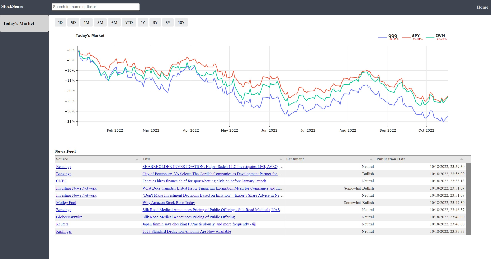
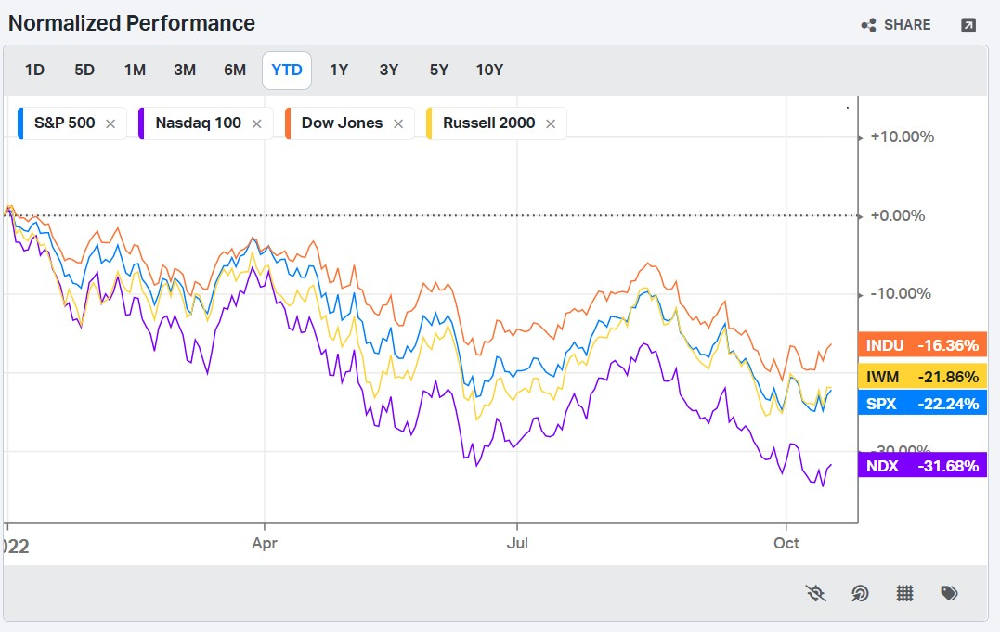

# Hands Off JS

### Intro and Inspiration
There is an amazing amount of interactivity that can be achieved on a website without
needing to use `javascript`. To demonstrate this idea, this repository runs the
following site: [example site](http://dashboard.zmaytechstack.com/) with almost no `js`.
The inspiration was to implement just a few of the features that are a part
of [koyfin's](https://app.koyfin.com/) website without any `js`. And in doing so 
show that you can get a lot of the same feel and functionality as a `REACT` site 
or similar. I'll walk through a couple of the features but feel free to explore
the code to get a better sense of what is going on. In the appendix, setup instructions
are provided.

The site has the following functionality:

1. Updating the chart based on timeframe selection.
2. Search bar to search for US listed securities.
3. Polling to update the news feed every 5 minutes.

All can be seen on the homepage:



None of these features uses `javascript` (although the table does rely on the `javascript` package Tabulator). 
To allow for the response nature of the site, we use on an interesting package called
[htmx](https://htmx.org/) and instead of sending json between the server and the browser,
you send html.

### Example
They way the site uses this package can be shown with the cumulative return chart.
The following [code](https://github.com/azakmay/dashboard-sample/blob/master/apps/templates/home/macros.html)
generates the buttons along the top of the chart.

```html



    
        <div class="trigger-button"
             hx-post="{{ endpoint }}"
             hx-trigger="click"
             hx-indicator="#indicator"
             hx-target="{{ target }}"
             hx-vals='{"window": "{{ button }}"}'
             id="{{ button }}">{{ button }}
        </div>
    

```

Then in the main [html](https://github.com/azakmay/dashboard-sample/blob/master/apps/templates/home/todays-market-grid.html)
for the homepage, the endpoint that is specified is `/chart/cum_returns`. This sends a `POST` request to the server:

```python
@application.route('/chart/cum_returns', methods=['GET', 'POST'])
def chart_cumreturns():
    view = MarketView()
    return view.get_daily_market_chart_html()
```

which generates html to replace the plot on the screen with an updated version. And just like that, with no `js`,
we can generate a chart with similar functionality to that on
[https://app.koyfin.com/](koyfin).



### Benefits
There are a few benefits to generate the html on the server side:
1. Language consistency: Stay in the same language as the backend code (e.g., `Python` for this example)
2. Rapid prototyping: Easier to get a bunch of visuals - think dashboards - up in less time

### Conclusion
This is definitely not a bad approach if you're building a site and maintaining it yourself.

### Setup
